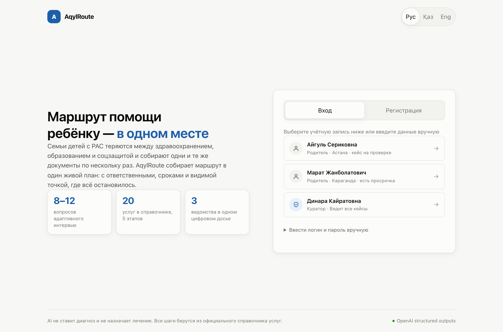
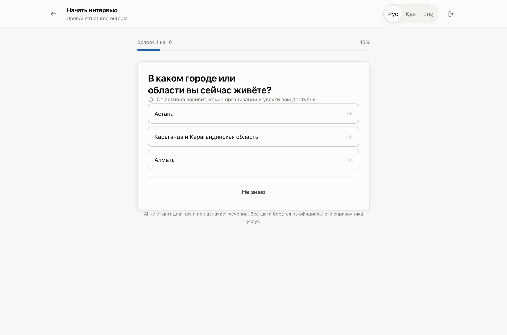
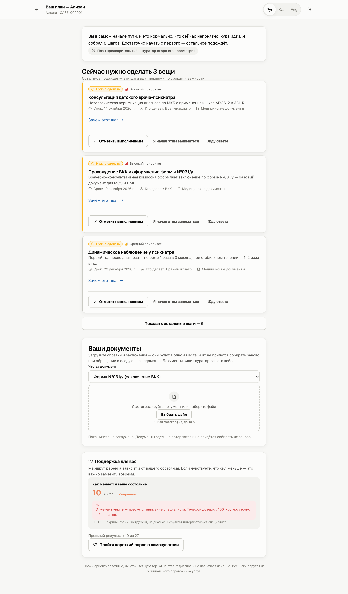
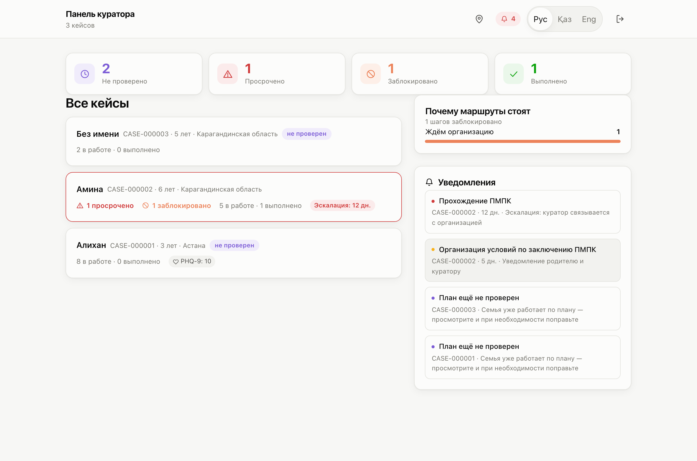
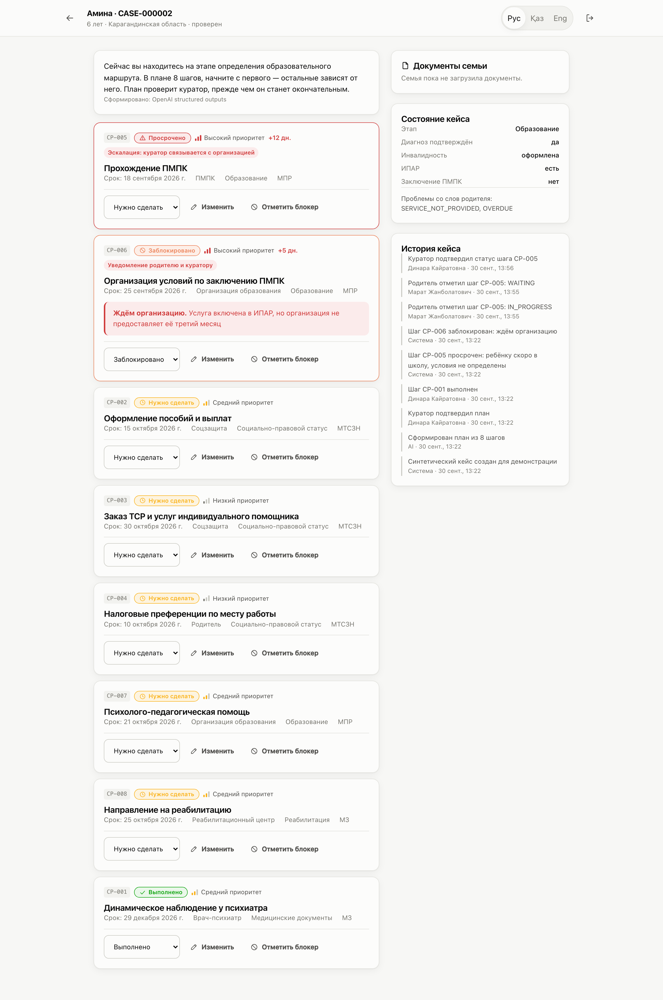
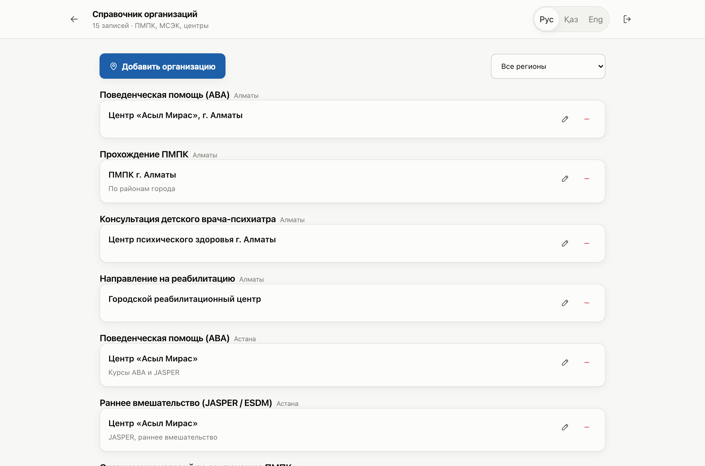

# AqylRoute AI — единый маршрут ребёнка с РАС

**Команда:** AqylRoute AI — единый маршрут ребёнка с РАС

Межведомственный навигатор для семей детей с расстройством аутистического спектра
в Казахстане. Разработано по требованиям Карагандинского медицинского университета.

---

## Проблема

Родители детей с РАС теряются между тремя ведомствами и повторно собирают одни
и те же документы:

| Ведомство | Что оформляет |
|---|---|
| Министерство здравоохранения | Заключение психиатра, ВКК, форма №031/у |
| Министерство труда и соцзащиты | МСЭ, инвалидность, ИПАР, пособия, ТСР |
| Министерство просвещения | ПМПК, образовательный маршрут, тьютор |

Каждое ведомство видит только свой участок. Никто не видит маршрут ребёнка целиком,
поэтому семья ходит по кругу, а специалисты не знают, где именно всё остановилось.

Три последствия:

1. **Потерянное время.** При РАС раннее вмешательство определяет прогноз, а недели
   уходят на повторный сбор справок.
2. **Невидимая просрочка.** Пропущенный срок ПМПК перед школой выясняется, когда
   учебный год уже начался.
3. **Выгорание родителя.** Оно останавливает маршрут ребёнка не реже, чем очереди
   в учреждениях, но в существующих системах никем не отслеживается.

---

## Решение

Веб-приложение, которое за 12 вопросов определяет, где находится семья, и
превращает разрозненную информацию в один проверяемый межведомственный план.

```
РОДИТЕЛЬ
   │
   ↓  12 адаптивных вопросов
AI-ИНТЕРВЬЮ
   │
   ↓  извлечение структуры
CASE STATE — документы, услуги, обращения, состояние родителя
   │
   ↓  ограничение выбора
SERVICE CATALOG — 20 услуг, 5 этапов трека, 3 региона
   │
   ↓  OpenAI structured outputs
CASE PLAN — шаги с приоритетом, сроком, ответственным ведомством
   │
   ├──────────────────────────┐
   ↓                          ↓
РОДИТЕЛЬ видит план       КУРАТОР правит сроки и шаги,
сразу после интервью      снимает блокеры, ведёт статусы
   │                          │
   └──────────┬───────────────┘   правки видны родителю немедленно
              ↓
   DEADLINE ENGINE → OVERDUE → ЭСКАЛАЦИЯ 1 / 3 / 7 / 14 дней
```

### Ключевое техническое решение

Требование «AI берёт действия только из справочника услуг» выполняется **типом,
а не просьбой в промпте**. Перед вызовом модели список допустимых `service_id`
подставляется в JSON Schema как `Literal`, суженный до услуг, доступных этому
региону и возрасту ребёнка:

```python
ids = tuple(s["id"] for s in catalog.eligible(region, child_age))
ItemBound = create_model("CasePlanItemBound", __base__=CasePlanItem,
                         service_id=(Literal[ids], ...))
```

Декодер OpenAI физически не может вернуть значение вне этого списка. Так же
ограничены приоритеты, ответственные роли, статусы, типы блокеров и коды вопросов
интервью. Модель не может отправить семью к несуществующему специалисту.

### Что делает AI, а что код

| Делает модель | Делает код, без участия AI |
|---|---|
| Выбирает и формулирует следующий вопрос | Просрочка: срок прошёл и статус не DONE |
| Извлекает состояние кейса из ответов | Эскалация по порогам 1, 3, 7, 14 дней |
| Подбирает шаги, приоритеты, сроки | Порядок процедур: МСЭ невозможна без формы №031/у |
| Пишет объяснение для родителя | Этап маршрута выводится из документов семьи |

**AI отвечает за понимание и объяснение, код — за процедуру и сроки.**

Услуги, о которых интервью не дало данных, в план не попадают, а выводятся
куратору отдельным списком на уточнение. Система не ставит шаг наугад.

---

## Демо

Приложение запускается локально (см. раздел «Запуск»), вход под демонстрационными
учётными записями.

| Экран | |
|---|---|
| Вход |  |
| Адаптивное интервью |  |
| План глазами родителя |  |
| Панель куратора |  |
| Карточка кейса |  |
| Справочник организаций |  |

### Учётные записи

| Логин | Пароль | Роль | Что показывает |
|---|---|---|---|
| `parent` | `parent123` | Родитель | Кейс «Раннее начало»: маршрут с нуля |
| `parent2` | `parent123` | Родитель | Кейс «Застрявший маршрут»: просрочка и блокер |
| `curator` | `curator123` | Куратор | Все кейсы, сводка, справочник организаций |

### Сценарий демонстрации, 3 минуты

1. Войти как **куратор** — видна сводка: просрочка 12 дней, один блокер,
   один непроверенный план, аналитика по причинам остановки.
2. Открыть кейс **Амины** — ПМПК просрочена перед первым классом, услуга
   из ИПАР не предоставляется третий месяц. Видны и срок, и причина.
3. Открыть кейс **Алихана** — семья только вошла в систему, AI построил
   маршрут с нуля, соблюдая порядок: без формы №031/у на МСЭ не попасть.
4. Поправить срок шага и нажать **«Отметить проверенным»** — правка доходит
   до родителя немедленно.
5. Войти как **родитель** — три ближайших дела простым языком: что сделать,
   до какого числа, какие документы взять, куда идти и кому звонить.
6. Показать блок **поддержки родителя** — скрининг PHQ-9 с динамикой.

---

## Запуск

### Требования

- **Python 3.11+**
- **Node.js 20+**
- Ключ OpenAI — необязателен: без него работает демонстрационный режим

### Установка

```bash
git clone https://github.com/Medventures/Haqaton-022.git
cd Haqaton-022

python3 -m venv backend/.venv
backend/.venv/bin/pip install fastapi uvicorn[standard] openai pydantic python-multipart

cd frontend && npm install && cd ..
```

### Переменные окружения

Скопировать `.env.example` в `.env` в корне проекта:

```ini
OPENAI_API_KEY=            # ключ OpenAI; без него работает демонстрационный режим
OPENAI_MODEL=gpt-4o-mini   # модель для интервью и построения плана
INTERVIEW_MODE=adaptive    # adaptive — AI переформулирует вопросы; canonical — строго по справочнику
CURATOR_INVITE_CODE=       # код для регистрации куратора
```

Секретные значения в репозиторий не попадают: `.env` в `.gitignore`.

### Запуск

Одной командой:

```bash
./start.sh
```

Или вручную, в двух вкладках терминала.

Вкладка 1, бэкенд (порт 8000):

```bash
cd backend
.venv/bin/uvicorn app.main:app --port 8000 --reload
```

Вкладка 2, фронтенд (порт 3000):

```bash
cd frontend
npm run dev
```

Открыть **http://localhost:3000**. Документация API: **http://127.0.0.1:8000/docs**

При первом запуске создаются база, два синтетических кейса и справочник организаций.

### Если порт занят

```bash
pkill -f "next dev"; pkill -f uvicorn
```

---

## Структура проекта

```
domain/
  enums.json              справочники статусов, ролей, блокеров, этапов трека

backend/
  data/
    services.json         каталог услуг — единственный источник действий для AI
    questions.json        12 вопросов интервью на трёх языках
  app/
    schemas.py            Pydantic-модели, они же контракт для OpenAI
    ai.py                 structured outputs, проверки плана, демонстрационный режим
    catalog.py            фильтрация услуг по региону и возрасту, валидация плана
    deadline.py           просрочка и эскалация
    phq9.py               скрининг состояния родителя
    db.py                 SQLite: весь доступ к данным собран здесь
    seed.py               два синтетических кейса и справочник организаций
    main.py               HTTP API

frontend/
  app/
    page.tsx              вход и регистрация
    interview/            адаптивное интервью
    plan/                 план глазами родителя
    curator/              панель куратора
    curator/case/         карточка кейса: правка шагов, блокеры, история
    curator/facilities/   справочник организаций
  components/
    ui.tsx                иконки, статусы, шапка
    documents.tsx         загрузка документов
    wellbeing.tsx         динамика состояния родителя
    phq.tsx               опросник PHQ-9
  lib/
    api.ts                клиент API
    i18n.ts               русский, казахский, английский

docs/screenshots/         снимки экранов для этого README
```

### Стек

| Слой | Технология |
|---|---|
| Фронтенд | Next.js 16, React 19, TypeScript, Tailwind 4 |
| Бэкенд | FastAPI, Pydantic 2, Python 3.14 |
| AI | OpenAI structured outputs (`responses.parse`), `gpt-4o-mini` |
| База | SQLite |

---

## Что готово

### Родитель

- Адаптивное интервью: 12 вопросов, вопросы с уже известным ответом пропускаются
- План человеческим языком: что сделать, до какого числа, какие документы нужны
- Фокус на трёх ближайших шагах, остальные по кнопке
- Контакты организаций прямо в шаге: адрес, телефон, контактное лицо, часы приёма
- Ведение статусов: «выполнено», «начал заниматься», «жду ответа»
- Загрузка документов: PDF и фотографии до 10 МБ
- Скрининг собственного состояния PHQ-9 с отслеживанием динамики
- Три языка интерфейса: русский, казахский, английский
- Тёмная тема, адаптация под телефон

### Куратор

- Сводка по всем кейсам: просрочено, заблокировано, не проверено
- Аналитика по причинам остановки, а не просто «17 просрочено»
- Правка шагов: название, приоритет, ответственный, срок — видна родителю сразу
- Блокеры с типом и описанием
- Подтверждение статусов, отмеченных родителем
- Справочник организаций: ПМПК, МСЭК и центры по районам с контактами
- История кейса и уведомления об эскалации

### Ядро

- 20 услуг по 5 этапам межведомственного трека, 3 региона
- Механическая эскалация без участия AI: пороги 1, 3, 7, 14 дней
- Три линии защиты плана: ограничение схемы, валидация по региону и возрасту,
  достройка недостающих предпосылок
- Два синтетических кейса, воспроизводимых одинаково при каждом запуске
- Демонстрационный режим: приложение полностью работает без ключа OpenAI

### Проверено

| Проверка | Результат |
|---|---|
| Все коды услуг в плане есть в каталоге | пройдена |
| Интервью укладывается в 8–12 вопросов | пройдена |
| Один вопрос не задаётся дважды | пройдена |
| Уже пройденные семьёй шаги в план не попадают | пройдена |
| Услуги без данных из интервью в план не попадают | пройдена |
| Порядок процедур соблюдён | пройдена |
| Чужой родитель не может скачать документ | 403 |
| Роль куратора без кода не выдаётся | 403 |

Вёрстка снята headless-браузером на 390px и 1440px: горизонтального переполнения
нет, зон нажатия мельче 40px нет, ошибок в консоли нет.

### Известные ограничения

- **Сроки услуг условные.** Проставлены правдоподобные значения, помечены
  в `services.json` и в интерфейсе. Куратор правит срок каждого шага вручную.
  Замена на нормативные — правка одного файла.
- **PHQ-9 вместо шкалы Бека.** BDI-II лицензируется правообладателем и не может
  использоваться в публичном продукте. PHQ-9 — открытая валидированная шкала.
  Это скрининг, а не диагноз.
- **Родитель видит план сразу**, не дожидаясь проверки куратором: ожидание стоило
  бы семье времени, а именно его продукт и экономит. До отметки о проверке план
  помечен как предварительный. Риск ограничен тем, что AI не может выйти за
  справочник услуг и не соблюсти порядок процедур.
- **Данные синтетические**, персональных данных в репозитории нет.
- **Аутентификация упрощена:** PBKDF2 и токен в localStorage. Для внедрения
  нужны bcrypt или argon2, HttpOnly-cookie и HTTPS.
- **AI не ставит диагноз и не назначает лечение** — закреплено в системном
  промпте и в ограничениях схемы.
- **Уведомления внутри приложения.** Отправка email и SMS не реализована.
- **SQLite.** Весь доступ к данным изолирован в `db.py`, поэтому переход
  на Supabase затрагивает только этот файл.
